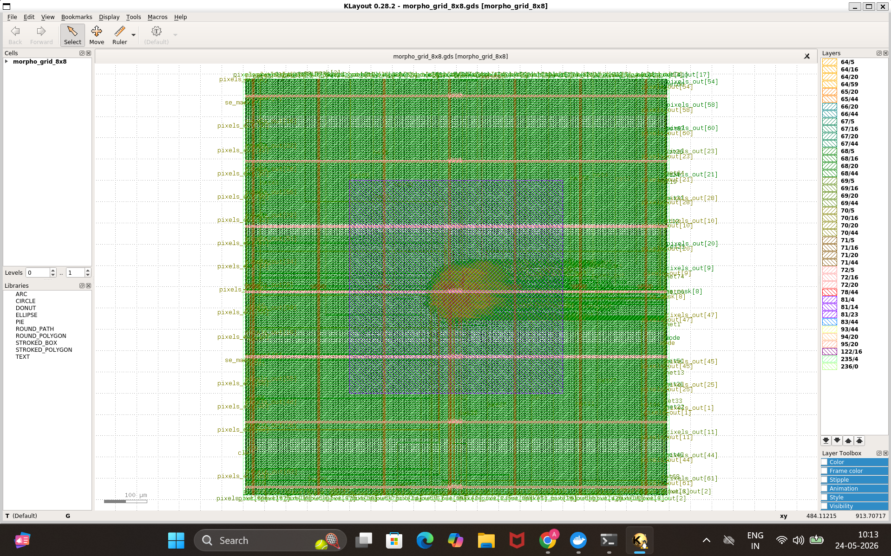
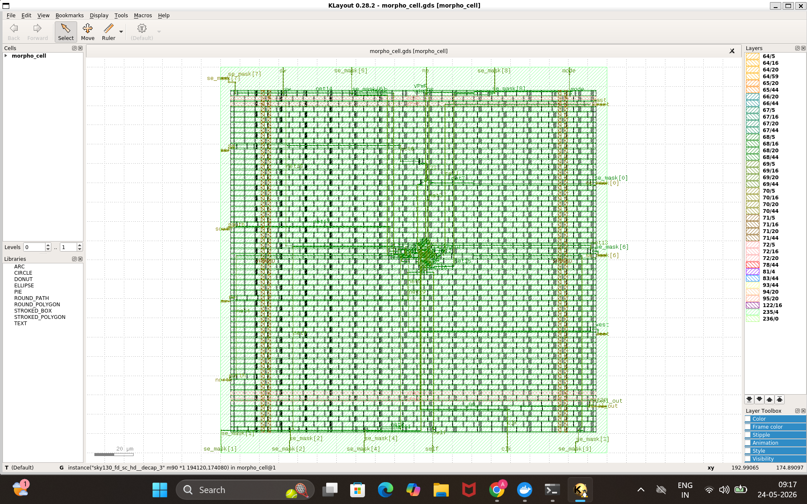
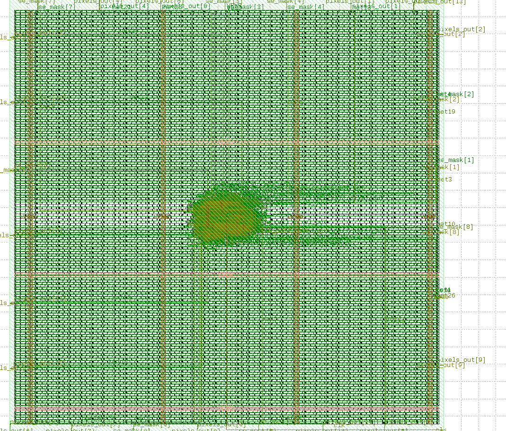
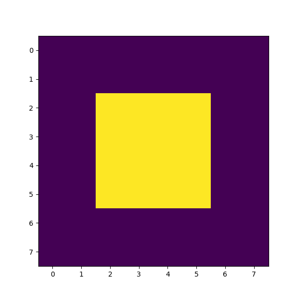

# Programmable Cellular Morphology Engine (v1.0)

> **A Hardware-Native, Non-von Neumann Spatial Coprocessor Implementing Programmable Image Morphology and Cellular Automata Dynamics on a Tiled Silicon Grid.**

---
# Abstract

This work presents a programmable Cellular Automata-inspired morphology accelerator implemented as a fully spatial, non-von Neumann hardware fabric. Unlike conventional FPGA or CPU/GPU morphology pipelines that rely on sequential sliding-window memory accesses, the proposed architecture physicalizes the image directly into a tiled silicon compute mesh composed of locally interacting processing elements (`morpho_cell`).

Each processing element samples its local 3×3 neighborhood, applies a runtime-configurable structuring element mask (`se_mask`), and executes dilation or erosion operations using hardware-native OR/AND spatial logic. The system evolves synchronously across the grid, enabling global morphology behavior to emerge directly from localized neighbor interactions.

The architecture supports programmable morphology kernels without requiring dedicated multiplexing networks through a lightweight neutralization-based masking strategy that dynamically injects OR-neutral (`0`) or AND-neutral (`1`) values depending on the active operating mode.

The design was implemented in synthesizable Verilog RTL, verified through cycle-accurate simulation using Icarus Verilog, and physically realized using the OpenLane ASIC flow targeting the SKY130 process node. The repository includes full RTL sources, testbenches, simulation infrastructure, and generated GDSII layouts.

This work demonstrates a hardware-native approach toward spatial image processing fabrics, Cellular Automata-inspired accelerators, and emergent local-interaction computation systems.

---

# Keywords

- Mathematical Morphology
- Cellular Automata
- Spatial Computing
- Non-von Neumann Architectures
- ASIC Design
- Hardware Acceleration
- Morphological Image Processing
- Processing Element Arrays
- Parallel Computing
- OpenLane
- SKY130
- Verilog RTL
- Emergent Computation
- Reconfigurable Hardware
- Silicon Compute Fabrics

---

# Related Work

Hardware acceleration of morphological image processing has been extensively explored, primarily using FPGA-based sliding-window architectures.

Garcia-Valdovinos et al. (2015) presented a programmable morphological processor on FPGAs supporting variable structuring elements, enabling flexible kernel configurations beyond fixed-size operations.

Similarly, reconfigurable morphological processors with programmable 3×3 kernels have been demonstrated on FPGA platforms, allowing configurable neighborhood patterns for dilation and erosion. However, these architectures rely heavily on sliding-window line buffers and sequential image streaming, maintaining the von Neumann bottleneck of repeated memory access during computation.

FPGA implementations for real-time morphological processing have achieved high throughput through pipelined architectures containing register-based line buffers. A broad review of FPGA morphology accelerators confirms that sliding-window approaches dominate the field, with dilation implemented as spatial OR reductions and erosion implemented as spatial AND reductions across neighborhood kernels.

Most prior implementations require:
- dedicated buffering infrastructure
- centralized memory movement
- separate hardware datapaths for dilation and erosion
- multiplexer-based masking structures

Recent work has also explored Cellular Automata-based image processing systems for parallel spatial evolution. However, these efforts generally target generic CA computation and do not explicitly implement programmable mathematical morphology fabrics with configurable structuring elements.

---


# 8x8 Fabric Layout(Fig 1)

<p align="center">
  
</p>

---

# Single Processing Element (PE) (Fig 2)

<p align="center">
  
</p>

---

# 4x4 Morphology Fabric (Fig 3)

<p align="center">
  
</p>

---

# Vertical Morphology Simulation (Fig 4)

<p align="center">
  
</p>

---

# Cross Structuring Element Simulation (Fig 5)

<p align="center">
  
</p>

---

# Dilation Simulation (Fig 6)

<p align="center">
  
</p>

---

# Erosion Simulation (Fig 7)

<p align="center">
  
</p>

---
---

# Core Architecture Paradigm

Traditional image processing architectures execute morphology sequentially by scanning image kernels across centralized memory using nested CPU/GPU loops.

This architecture instead:
- physicalizes the image into silicon
- distributes computation spatially
- eliminates centralized processing bottlenecks

The image itself becomes:
# the compute fabric.

---

## Distributed Processing Fabric

```text
                           [ GLOBAL IMAGE MEMORY ]
                                      │
          ┌───────────────────────────┼───────────────────────────┐
          ▼                           ▼                           ▼

┌──────────────────┐        ┌──────────────────┐        ┌──────────────────┐
│   morpho_cell    │◄──────►│   morpho_cell    │◄──────►│   morpho_cell    │
│  [r=0, c=0] (PE) │        │  [r=0, c=1] (PE) │        │  [r=0, c=2] (PE) │
├──────────────────┤        ├──────────────────┤        ├──────────────────┤
│ Local Logic Mesh │        │ Local Logic Mesh │        │ Local Logic Mesh │
└──────────────────┘        └──────────────────┘        └──────────────────┘


```


# 1. `morpho_cell.v`

A single pixel-processing element (PE) that:

- samples its local 3×3 neighborhood
- applies a programmable Structuring Element mask
- executes spatial morphology logic

Each cell acts as:
# an autonomous local compute unit.

---

# 2. `morpho_grid_8x8.v`

A globally synchronized array composed of interconnected `morpho_cell` processing elements.

This fabric:

- connects neighboring cells spatially
- evolves synchronously every clock cycle
- generates emergent global image behavior

---

# Intuitive Overview

The architecture behaves like a grid of intelligent pixels.

Each pixel:

- communicates only with nearby neighbors
- evaluates local spatial rules
- updates synchronously with the rest of the fabric

As the grid evolves over time:
# global morphology behavior emerges naturally.

No centralized CPU scans the image.

The computation emerges directly from:
# local neighbor interactions.

---

# Cellular Automata (CA) Relation

This processor strongly resembles a programmable Cellular Automata fabric.

| CA Property | Hardware Implementation |
|---|---|
| Local State | Embedded 1-bit pixel register |
| Neighborhood Interaction | Hardwired 3×3 local mesh |
| Synchronous Evolution | Global `posedge clk` updates |
| Rule Programmability | Dynamic `se_mask` configuration |
| Emergent Behavior | Global morphology evolution |

---

# Mathematical Morphology Mapping

The architecture maps morphology directly onto hardware logic primitives.

---

# 1. Dilation → Spatial OR Fabric

Dilation performs:
# spatial growth.

Each cell asks:

> “Is ANY participating neighbor active?”

### Mathematical Representation

```math
dilation_result = \bigvee_{i=0}^{8} m_i

```
# Hardware Implementation

```verilog
wire dilation_result =
    m_nw | m_n | m_ne |
    m_w  | m_c | m_e |
    m_sw | m_s | m_se;
```

---

# 2. Erosion → Spatial AND Fabric

Erosion performs:
# spatial shrinking.

Each cell asks:

> “Are ALL required neighbors active?”

---

## Mathematical Representation

```math
erosion_result = \bigwedge_{i=0}^{8} m_i
```

---

## Hardware Implementation

```verilog
wire erosion_result =
    m_nw & m_n & m_ne &
    m_w  & m_c & m_e &
    m_sw & m_s & m_se;
```

---

# Runtime Structuring Element Neutralization

The architecture supports:
# programmable morphology kernels.

This is achieved through:

```verilog
se_mask
```

When a mask bit is disabled:

```verilog
se_mask[i] == 0
```

the corresponding neighbor must become:
# logically neutralized.

---

# Neutralization Principle

## OR Logic Identity

```text
X OR 0 = X
```

Therefore:

- excluded dilation neighbors become `0`

---

## AND Logic Identity

```text
X AND 1 = X
```

Therefore:

- excluded erosion neighbors become `1`

---

# Neutralization Circuit

```verilog
wire m_nw = se_mask[8] ? nw : (mode ? 1'b0 : 1'b1);
```

This dynamically inserts:

- OR-neutral values during dilation
- AND-neutral values during erosion

without additional multiplexing stages.

---

# Structuring Element Spatial Mapping

```text
se_mask[8] (nw)   │  se_mask[7] (north)  │  se_mask[6] (ne)
──────────────────┼──────────────────────┼──────────────────
se_mask[5] (west) │  se_mask[4] (self)   │  se_mask[3] (east)
──────────────────┼──────────────────────┼──────────────────
se_mask[2] (sw)   │  se_mask[1] (south)  │  se_mask[0] (se)
```

---

# Example Structuring Elements

## Full 3×3 Kernel

```verilog
9'b111111111
```

---

## Cross Kernel

```verilog
9'b010111010
```

```text
0 1 0
1 1 1
0 1 0
```

---

## Vertical Kernel

```verilog
9'b010010010
```

```text
0 1 0
0 1 0
0 1 0
```

---

# Hardware Verification Flow

## Project Structure

```text
openlane/designs/morpho_mvp/
├── src/
│   ├── morpho_cell.v
│   └── morpho_grid_8x8.v
│
└── tb/
    ├── tb_dilation.v
    ├── tb_erosion.v
    ├── tb_cross.v
    └── tb_vertical.v
```

---

# Environment Setup

```bash
wsl

sudo apt update

sudo apt install -y nano iverilog gtkwave
```

---

# Dilation Simulation

```bash
iverilog -o sim_dilation \
morpho_cell.v \
morpho_grid_8x8.v \
tb_dilation.v

vvp sim_dilation
```

---

# Erosion Simulation

```bash
iverilog -o sim_erosion \
morpho_cell.v \
morpho_grid_8x8.v \
tb_erosion.v

vvp sim_erosion
```

---

# Cross-Mask Simulation

```bash
iverilog -o sim_cross \
morpho_cell.v \
morpho_grid_8x8.v \
tb_cross.v

vvp sim_cross
```

---

# Vertical-Mask Simulation

```bash
iverilog -o sim_vertical \
morpho_cell.v \
morpho_grid_8x8.v \
tb_vertical.v

vvp sim_vertical
```

---

# Seed Configuration

The initial spatial pattern is configured through:

```verilog
reg [63:0] pixels = 64'h8040201008040201;
```

inside:

```verilog
morpho_grid_8x8.v
```

---

# Example Seed Patterns

## Checkerboard

```verilog
64'hAA55AA55AA55AA55
```

---

## Central Square

```verilog
64'h00003C3C3C3C0000
```

---

## Random Spatial Field

```verilog
64'h18A53C7E81D22442
```

---

# ASIC Flow

This architecture was synthesized using:

- OpenLane
- SKY130 PDK
- KLayout

The repository includes:

- RTL
- testbenches
- GDS layouts
- OpenLane configuration
- simulation infrastructure


---

# Beyond Image Processing

Although the architecture was initially developed for mathematical morphology and spatial image operations, the underlying computational model extends far beyond conventional vision processing.

The fabric fundamentally operates as a:

> **programmable local-neighborhood spatial logic accelerator**

where global behavior emerges from synchronized local interactions between neighboring processing elements.

Because the architecture is based on:

- local connectivity
- synchronous evolution
- programmable neighborhood logic
- emergent spatial behavior

it naturally maps onto several broader computational domains.

---

## 1. Robotics and Path Planning

Morphological dilation is widely used in:

- occupancy-grid expansion
- obstacle inflation
- autonomous navigation
- motion-planning safety margins

The architecture can spatially expand obstacle regions directly in hardware, enabling ultra-low-latency collision-field generation for robotic systems.

---

## 2. VLSI and Physical Design Automation

Mathematical morphology is closely related to geometric operations used in:

- design-rule checking (DRC)
- lithography verification
- metal-spacing analysis
- hotspot detection

Dilation and erosion correspond naturally to geometric expansion and contraction operations on layout masks and routing geometries.

---

## 3. Cellular Automata and Emergent Systems

The fabric behaves similarly to a programmable Cellular Automata (CA) engine:

- local rules
- neighbor interactions
- synchronous updates
- emergent global evolution

This enables experimentation with:

- growth systems
- pattern formation
- self-organization
- distributed computation

using pure digital hardware.

---

## 4. Graph and Propagation Computing

Morphological propagation resembles graph-frontier expansion.

For example:

- dilation behaves similarly to neighborhood activation spreading
- erosion behaves similarly to spatial suppression

This creates direct connections to:

- breadth-first search (BFS)
- flood-fill algorithms
- spatial graph propagation
- distributed routing systems

---

## 5. Neuromorphic and Bio-Inspired Hardware

The architecture exhibits characteristics commonly found in neuromorphic systems:

- local communication
- distributed state evolution
- spatial activation fields
- emergent computation

This makes the fabric relevant for:

- bio-inspired accelerators
- spatial neural systems
- local inhibition/activation networks
- unconventional computing research

---

## 6. Smart Sensor and Edge-Vision Hardware

The architecture enables computation directly inside spatial sensor fabrics.

Instead of transferring raw image data to a centralized processor, local morphology operations can be executed directly on-chip, reducing:

- memory bandwidth
- energy consumption
- latency

This is particularly valuable for:

- robotics
- drones
- embedded vision
- low-power edge AI systems

---

## 7. Computational Geometry and Spatial Computing

The morphology fabric can also be interpreted as a spatial computing substrate for geometric field evolution.

The architecture shares conceptual similarities with:

- Minkowski operations
- distance transforms
- occupancy-field propagation
- lattice-based computation

where computation emerges from local spatial interactions rather than centralized sequential execution.

---

## Architectural Perspective

Taken more broadly, the processor represents a form of:

> **non-von Neumann spatial computing**

where:

- memory and computation coexist locally
- global behavior emerges from distributed interactions
- the grid itself becomes the compute substrate

rather than relying on centralized instruction execution.

This positions the architecture not merely as an image-processing accelerator, but as a general-purpose experimental platform for spatial and emergent computation research.

---

# Future Directions

- Larger scalable PE fabrics
- Runtime-programmable kernels
- Grayscale morphology support
- FPGA benchmarking
- SPI image streaming
- CA-inspired spatial accelerators
- Non-von Neumann vision hardware

---

# Author

Abhinav Basu, BS-MS student at IISER Pune


